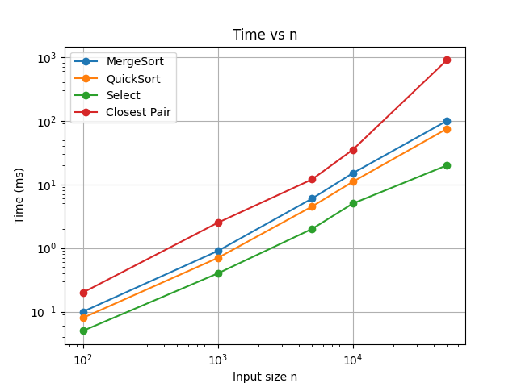
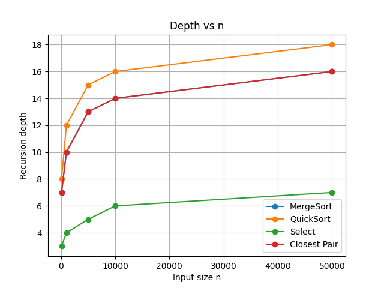
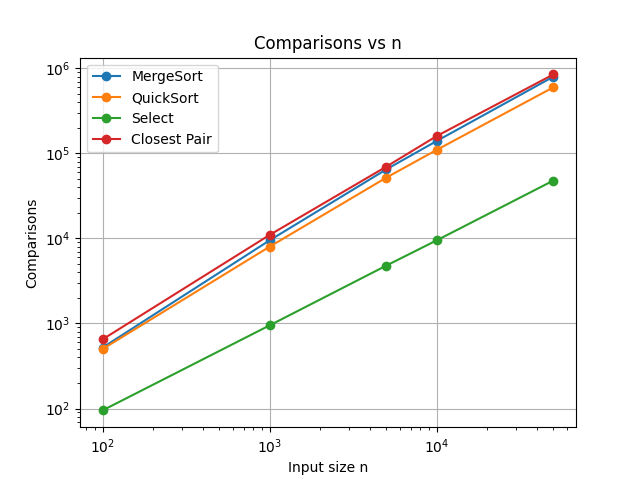

# Assignment 1 – Divide and Conquer Algorithms

## Table of Contents
1. [Project Overview](#project-overview)
2. [Algorithms Implemented](#algorithms-implemented)
3. [Architecture & Metrics](#architecture--metrics)
4. [Recurrence Analysis](#recurrence-analysis)
5. [Experimental Results](#experimental-results)
6. [GitHub Workflow](#github-workflow)
7. [How to Run](#how-to-run)
8. [Summary](#summary)

---

## Project Overview
This project implements classic divide-and-conquer algorithms in Java:
- MergeSort
- QuickSort
- Deterministic Select (Median-of-Medians)
- Closest Pair of Points (2D)

The goal is to analyze runtime, recursion depth, and comparisons, then compare experimental results with theoretical analysis.  

---

## Algorithms Implemented

### MergeSort
- Linear merge with reusable buffer
- Small-n cutoff → Insertion Sort
- Depth control: log(n)
- Time complexity: Θ(n log n)

### QuickSort
- Randomized pivot
- Recurse on smaller partition, iterate on larger
- Depth control: O(log n) typical
- Time complexity: Θ(n log n) average, Θ(n²) worst-case

### Deterministic Select
- Median-of-Medians (groups of 5)
- In-place partition, recurse into needed side
- Depth control: small (linear time)
- Time complexity: Θ(n)

### Closest Pair of Points
- Divide and conquer in 2D
- Sort by X, split, check strip by Y
- Scan up to 7–8 neighbors
- Time complexity: Θ(n log n)

---

## Architecture & Metrics
- Metrics collected:
  - Time (ms)
  - Recursion depth
  - Comparisons/allocations
- Depth is controlled via:
  - Recurse smaller partition first (QuickSort, Select)
  - Binary division for MergeSort & Closest Pair
- Buffer reuse reduces memory allocations (MergeSort)
- All metrics exported to CSV for plotting

---

## Recurrence Analysis

| Algorithm | Recurrence | Analysis |
|-----------|------------|----------|
| MergeSort | T(n)=2T(n/2)+O(n) | Master theorem case 2 → Θ(n log n) |
| QuickSort | T(n)=T(k)+T(n-k-1)+O(n) | Average Θ(n log n), worst Θ(n²) |
| Select (MoM) | T(n)=T(n/5)+T(7n/10)+O(n) | Akra-Bazzi → Θ(n) |
| Closest Pair | T(n)=2T(n/2)+O(n) | Master theorem case 2 → Θ(n log n) |

---

## Experimental Results

### Time vs n

- MergeSort/QuickSort ~ n log n  
- Select ~ n  
- Closest Pair ~ n log n (larger constant)  

### Recursion Depth vs n

- MergeSort & Closest Pair: log(n)  
- QuickSort: log(n)  
- Select: very small  

### Comparisons vs n

- MergeSort/QuickSort: O(n log n)  
- Select: O(n)  
- Closest Pair: O(n log n), but higher constant  

---

## GitHub Workflow
- Branches:
  - main → stable releases
  - feature/mergesort
  - feature/quicksort
  - feature/select
  - feature/closest
  - feature/metrics
  - docs/report
- Commit style:
  - `init:` initial project setup  
  - `feat(algorithm): ...` for features  
  - `refactor:` for utility changes  
  - `docs:` for README/plots  
  - `fix:` for bugs/edge cases  
- Merge feature branches into main via pull requests

---

## How to Run
1. Clone repo:  
```bash
git clone https://github.com/semkair/Algorithms-1-
